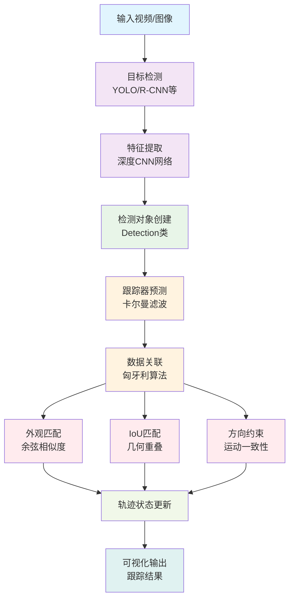
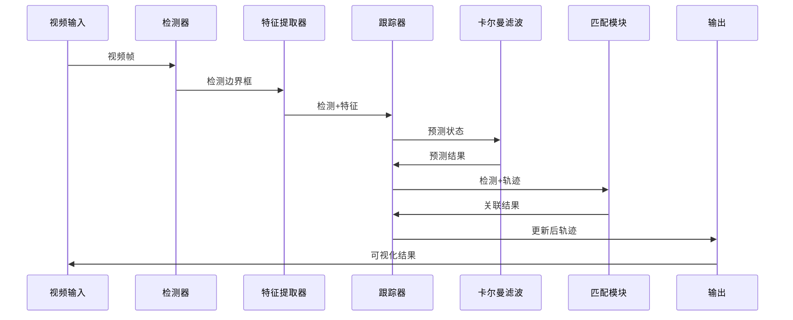
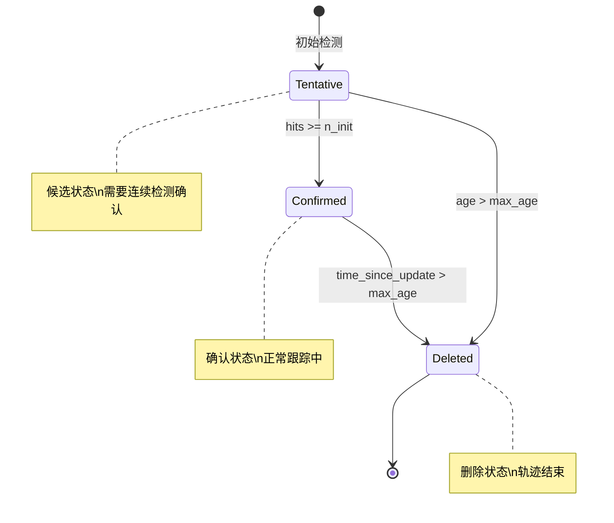
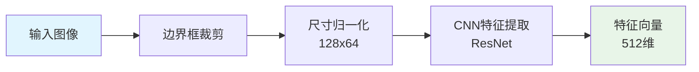
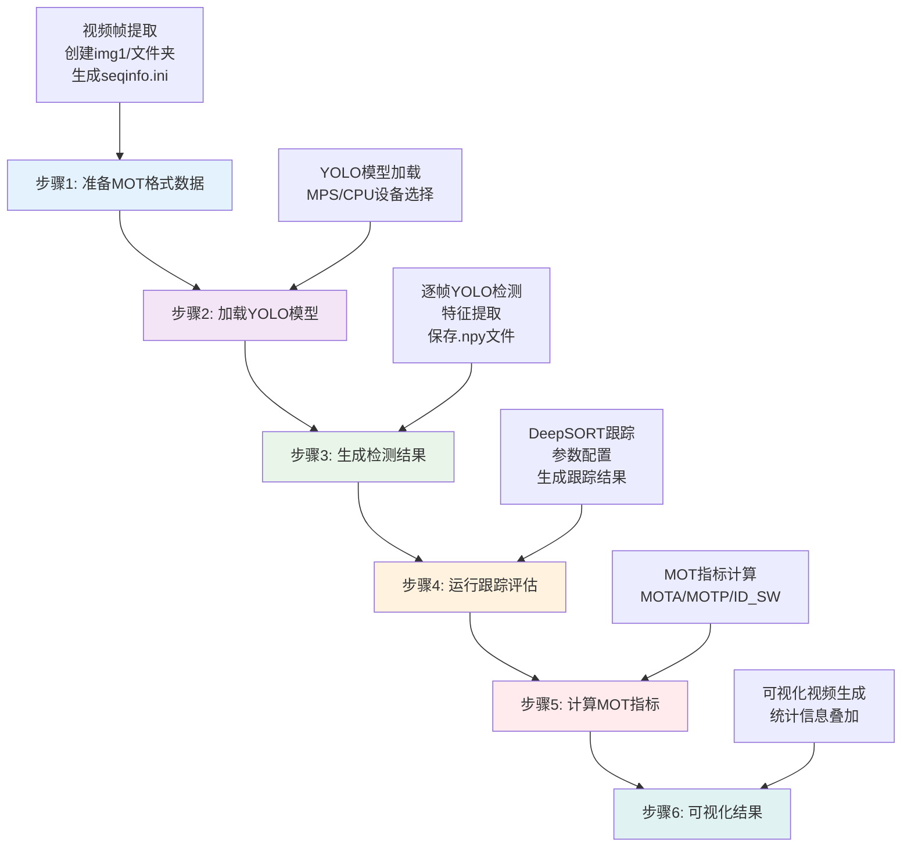
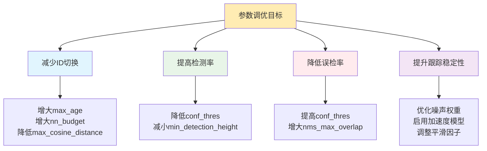

# Deep SORT 多目标跟踪系统项目结构文档

## 📁 项目概览

Deep SORT 是一个基于深度学习特征的多目标跟踪系统，结合了目标检测和外观特征匹配，实现了高精度的多目标跟踪。

```
deep_sort/
├── 📄 LICENSE                           # 开源许可证
├── 📄 README.md                         # 项目说明文档
├── 📁 deep_sort/                        # 🔥 核心跟踪算法模块
│   ├── __init__.py
│   ├── detection.py                     # 检测对象定义
│   ├── tracker.py                       # 主跟踪器
│   ├── track.py                         # 单个轨迹管理
│   ├── kalman_filter.py                 # 卡尔曼滤波器
│   ├── nn_matching.py                   # 最近邻特征匹配
│   ├── linear_assignment.py             # 匈牙利算法分配
│   └── iou_matching.py                  # IoU匹配
├── 📁 application_util/                 # 🔧 应用工具模块
│   ├── __init__.py
│   ├── preprocessing.py                 # 预处理工具
│   ├── visualization.py                 # 可视化工具
│   └── image_viewer.py                  # 图像显示器
├── 📁 tools/                           # 🛠️ 辅助工具
│   ├── generate_detections.py          # 特征提取工具
│   └── freeze_model.py                  # 模型冻结工具
├── 📄 deep_sort_app.py                  # 🚀 主应用程序
├── 📄 yolo_deepsort.py                  # YOLO集成脚本
├── 📄 evaluate_motchallenge.py          # MOT评估脚本
├── 📄 generate_videos.py                # 视频生成工具
├── 📄 get_pre_gt.py                     # GT预处理工具
├── 📄 show_results.py                   # 结果展示工具
├── 📄 评估追踪器性能yolo.py              # 🎯 性能评估主脚本
├── 📄 批处理评估追踪器性能yolo.py         # 批处理评估脚本
├── 📄 根据gt分析运动方程.py               # 运动分析工具
├── 📄 演示验证代码执行环境.py             # 环境验证脚本
├── 📄 requirements.txt                  # 基础依赖
└── 📄 requirements-gpu.txt              # GPU依赖
```

## 🏗️ 系统架构

### 整体架构图



### 数据流程图



## 🔍 核心模块详解

### 1. 🎯 deep_sort/ 核心跟踪模块

#### tracker.py - 主跟踪器
```python
# 关键类结构
class Tracker:
    """标准跟踪器 - 恒速度模型"""
    - predict()      # 预测下一帧状态
    - update()       # 基于检测更新轨迹
    - _match()       # 执行数据关联
    - _initiate_track()  # 初始化新轨迹

class AccelerationTracker(Tracker):
    """加速度跟踪器 - 含加速度模型"""
    - 12维状态空间 (x,y,a,h,vx,vy,va,vh,ax,ay,aa,ah)
    - 方向约束门控
    - 边界检测优化
```

**功能特点：**
- 📊 **多层匹配策略**：级联匹配 → 外观匹配 → IoU匹配
- 🎨 **状态管理**：Tentative → Confirmed → Deleted
- ⚡ **实时性能**：优化的算法实现，支持实时跟踪
- 🔒 **鲁棒性**：处理遮挡、误检测、轨迹分裂等挑战

#### track.py - 单轨迹管理
```python
class Track:
    """单个目标轨迹"""
    - track_id        # 唯一轨迹ID
    - hits           # 检测命中次数
    - age            # 轨迹生命周期
    - time_since_update  # 上次更新距离
    - state          # 轨迹状态
    - features       # 外观特征历史
```

**状态转换图：**


#### kalman_filter.py - 状态估计
```python
# 标准卡尔曼滤波器 (8维状态)
state = [x, y, a, h, vx, vy, va, vh]
# x,y: 中心坐标
# a: 宽高比  h: 高度
# vx,vy,va,vh: 对应速度

# 加速度卡尔曼滤波器 (12维状态)  
state = [x, y, a, h, vx, vy, va, vh, ax, ay, aa, ah]
# 额外的 ax,ay,aa,ah: 对应加速度
```

**运动模型对比：**

| 特性 | 标准模型 | 加速度模型 |
|------|----------|------------|
| 状态维度 | 8维 | 12维 |
| 运动假设 | 恒速度 | 恒加速度 |
| 适用场景 | 匀速运动 | 变速运动 |
| 计算复杂度 | 低 | 中等 |
| 跟踪精度 | 一般 | 更高 |

#### nn_matching.py - 特征匹配
```python
class NearestNeighborDistanceMetric:
    """最近邻距离度量"""
    - metric: 'euclidean' | 'cosine'
    - matching_threshold: 匹配阈值
    - budget: 特征库大小限制
    
    def distance(targets, candidates):
        """计算目标与候选之间的距离矩阵"""
```

**特征匹配流程：**


### 2. 🔧 application_util/ 应用工具

#### visualization.py - 可视化系统
```python
# 三种可视化模式
class Visualization:           # 交互式显示
class VideoOnlyVisualization:  # 仅视频录制  
class NoVisualization:         # 无显示处理

# 可视化功能
- 轨迹颜色编码
- 预测帧显示 (橙色框)
- 方向向量绘制
- 统计信息叠加
- ROI边界显示
```

**可视化效果说明：**
- 🟢 **绿色框**：正常跟踪的目标
- 🟠 **橙色框**：预测状态的目标 (标记"Pred")
- 🟡 **黄色区域**：计数检测区域
- ⚪ **白色文字**：ID和统计信息
- 🔵 **蓝色线条**：运动方向向量

### 3. 🛠️ tools/ 辅助工具

#### generate_detections.py - 特征提取
```python
# 支持两种模型格式
class ImageEncoder:         # 冻结图模型 (.pb)
class SavedModelEncoder:    # SavedModel格式

def create_box_encoder(model_filename, input_name="images", 
                      output_name="features", batch_size=32):
    """创建边界框特征编码器"""
```

**特征提取管道：**


## 🚀 主要应用脚本

### 评估追踪器性能yolo.py - 核心评估脚本

这是项目的**主要评估入口**，实现了完整的MOT性能评估流程：

#### 📋 主要功能模块

```python
# 1. 配置管理
FOLDER_PATH = "视频和GT文件夹路径"     # 自动查找视频和gt.txt
OUTPUT_DIR = "结果输出目录"           # 自动命名结果文件夹

# 2. YOLO检测参数
YOLO_PARAMS = {
    'model_path': "YOLO模型路径",      # 支持多种预训练模型
    'conf_thres': 0.7,               # 置信度阈值
    'iou_thres': 0.5,                # NMS IoU阈值
    'device': 'mps'/'cpu'            # 设备选择 (支持Apple Silicon)
}

# 3. 跟踪参数 (可调优)
TRACKING_PARAMS = {
    'max_age': 30,                   # 最大生命周期
    'n_init': 2,                     # 初始化帧数
    'max_iou_distance': 0.95,        # 最大IoU距离
    'use_acceleration': True,         # 启用加速度模型
    # 运动模型噪声权重
    'std_weight_position': 1.0/10,   # 位置噪声
    'std_weight_velocity': 1.0/40,   # 速度噪声  
    'std_weight_acceleration': 1.0/100, # 加速度噪声
}
```

#### 🔄 完整评估流程



#### 📊 关键性能指标

脚本自动计算并输出以下MOT评估指标：

| 指标 | 含义 | 重要性 |
|------|------|--------|
| **MOTA** | 多目标跟踪准确度 | ⭐⭐⭐⭐⭐ 最重要指标 |
| **MOTP** | 多目标跟踪精度 | ⭐⭐⭐⭐ 位置准确性 |
| **ID Switches** | 身份切换次数 | ⭐⭐⭐⭐ 跟踪一致性 |
| **False Positives** | 误检数量 | ⭐⭐⭐ 检测质量 |
| **Misses** | 漏检数量 | ⭐⭐⭐ 检测完整性 |
| **Precision/Recall** | 精确率/召回率 | ⭐⭐⭐ 基础指标 |

### deep_sort_app.py - 核心跟踪应用

```python
def run(sequence_dir, detection_file, output_file, **params):
    """主要跟踪函数"""
    # 1. 初始化跟踪器
    tracker = create_tracker(use_acceleration=True, **motion_params)
    
    # 2. 加载检测数据
    detections = np.load(detection_file)
    
    # 3. 逐帧处理
    for frame_idx in frame_indices:
        # 预测阶段
        tracker.predict()
        
        # 更新阶段  
        tracker.update(detections_in_frame)
        
        # 结果记录
        write_results(output_file, tracker.tracks, frame_idx)
```

## 🎛️ 参数调优指南

### 核心参数影响分析



### 推荐参数配置

```python
# 🎯 高精度配置 (适合复杂场景)
HIGH_PRECISION_CONFIG = {
    'max_age': 50,                    # 延长轨迹生命周期
    'n_init': 3,                      # 增加初始化要求
    'max_cosine_distance': 0.3,       # 严格外观匹配  
    'nn_budget': 100,                 # 增大特征库
    'use_acceleration': True,         # 启用加速度模型
}

# ⚡ 高速度配置 (适合实时应用)
HIGH_SPEED_CONFIG = {
    'max_age': 20,                    # 缩短生命周期
    'n_init': 1,                      # 快速初始化
    'max_cosine_distance': 0.5,       # 宽松匹配条件
    'nn_budget': 30,                  # 小特征库
    'use_acceleration': False,        # 禁用加速度模型
}

# ⚖️ 平衡配置 (推荐默认)
BALANCED_CONFIG = {
    'max_age': 30,                    # 适中生命周期
    'n_init': 2,                      # 适中初始化
    'max_cosine_distance': 0.4,       # 平衡匹配条件
    'nn_budget': 60,                  # 适中特征库
    'use_acceleration': True,         # 启用加速度模型
}
```

## 📈 性能优化建议

### 1. 硬件加速优化

```python
# GPU/MPS加速设置
if torch.backends.mps.is_available():
    device = 'mps'      # Apple Silicon优化
elif torch.cuda.is_available():
    device = 'cuda'     # NVIDIA GPU
else:
    device = 'cpu'      # CPU回退
```

### 2. 内存管理优化

```python
# 特征库大小控制
nn_budget = 60          # 限制内存使用
batch_size = 32         # 批处理大小平衡

# 轨迹数量控制  
max_age = 30           # 及时清理无效轨迹
```

### 3. 算法复杂度优化

| 组件 | 时间复杂度 | 空间复杂度 | 优化建议 |
|------|------------|------------|----------|
| 卡尔曼预测 | O(n) | O(n) | ✅ 已优化 |
| 特征匹配 | O(n×m×d) | O(n×d) | 调整nn_budget |
| 匈牙利算法 | O(n³) | O(n²) | 限制候选数量 |
| IoU计算 | O(n×m) | O(1) | ✅ 已优化 |

## 🔧 环境配置

### 依赖安装

```bash
# 基础环境
pip install -r requirements.txt

# GPU加速环境 (可选)
pip install -r requirements-gpu.txt

# YOLO集成 (用于实时检测)
pip install ultralytics
```

### 模型文件准备

```
models/
├── head_feature_encoder_best/    # 头部特征提取器
├── freeze10.pt                   # YOLO检测模型
├── freeze23.pt                   # 备用YOLO模型
└── finetune.pt                   # 微调模型
```

## 📖 使用示例

### 基础评估流程

```python
# 1. 设置输入路径
FOLDER_PATH = "/path/to/video_and_gt_folder"

# 2. 运行评估
python 评估追踪器性能yolo.py

# 3. 查看结果
ls output_folder/
├── mot_data/                     # MOT格式数据
├── detections/                   # 检测结果  
├── tracking_results/             # 跟踪结果
├── visualized_tracking.mp4       # 可视化视频
├── debugvideo.mp4               # 调试视频
├── count_results.json           # 计数统计
└── terminallog.txt              # 运行日志
```

### 批处理评估

```python
# 批量处理多个视频
python 批处理评估追踪器性能yolo.py

# 参数网格搜索
for max_age in [20, 30, 40]:
    for n_init in [1, 2, 3]:
        run_evaluation(max_age=max_age, n_init=n_init)
```

## 🎯 项目特色与创新点

### 1. 🚀 先进的跟踪算法
- **加速度卡尔曼滤波**：12维状态空间，更准确的运动预测
- **方向约束门控**：基于运动方向的智能关联约束
- **级联匹配策略**：多层次的数据关联算法

### 2. 🎨 灵活的可视化系统
- **多模式显示**：交互式、视频录制、无界面三种模式
- **智能颜色编码**：自动为每个轨迹分配唯一颜色
- **实时统计显示**：计数、速度、方向等信息实时叠加

### 3. ⚙️ 高度可配置性
- **100+参数**：涵盖检测、跟踪、可视化全流程
- **参数模板**：预设的高精度、高速度、平衡配置
- **实时调参**：支持运行时参数调整

### 4. 🔧 工程化设计
- **模块化架构**：松耦合设计，易于扩展和维护
- **异常处理**：完善的错误处理和日志记录
- **性能监控**：内置性能分析和优化建议

### 5. 📊 全面的评估体系
- **标准MOT指标**：MOTA、MOTP、ID切换等
- **自定义指标**：计数准确率、轨迹完整性等  
- **可视化分析**：轨迹图、统计图表、热力图

## 🎓 学习路径建议

### 初学者路径
1. **理解基础概念** → 阅读README.md和论文
2. **运行简单示例** → 使用预设参数评估单个视频
3. **参数实验** → 调整基础参数观察效果变化
4. **源码阅读** → 从detection.py开始理解数据结构

### 进阶用户路径  
1. **算法深入** → 研究卡尔曼滤波和匈牙利算法
2. **性能优化** → 针对特定场景调优参数
3. **功能扩展** → 添加新的匹配策略或可视化功能
4. **模型训练** → 训练自定义的特征提取网络

### 研究者路径
1. **算法改进** → 提出新的数据关联或状态估计方法
2. **基准测试** → 在多个数据集上进行全面评估
3. **方法对比** → 与其他SOTA方法进行对比分析
4. **论文发表** → 将改进方法整理成学术论文

---

> 💡 **提示**: 本文档基于项目当前版本编写，随着项目发展可能会有更新。建议结合源码注释和实际运行结果来理解系统行为。

> 🔗 **相关资源**: 
> - [Deep SORT原论文](https://arxiv.org/abs/1703.07402)
> - [MOT Challenge官网](https://motchallenge.net/)
> - [YOLO官方文档](https://docs.ultralytics.com/)

**文档生成时间**: 2025-06-20  
**项目版本**: dev_13062025